# design principles

## Serious / Elegant


## Minimalist / Simple

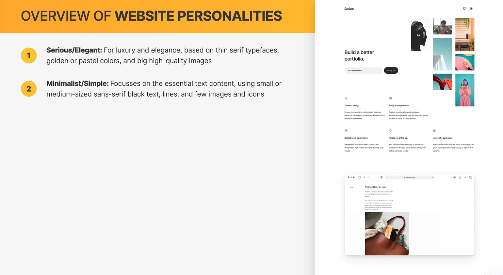

## Plain / Neutral

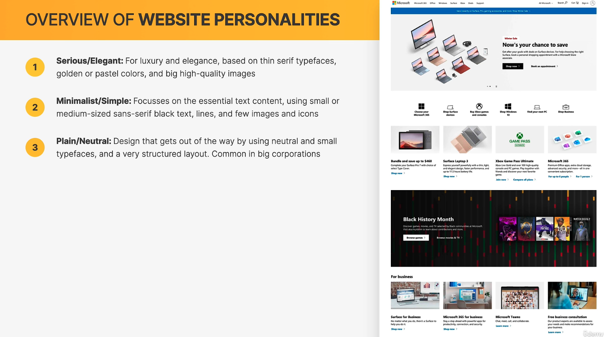

## Bold / Confident

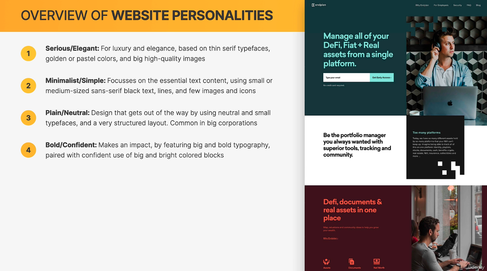

## Calm / Peaceful

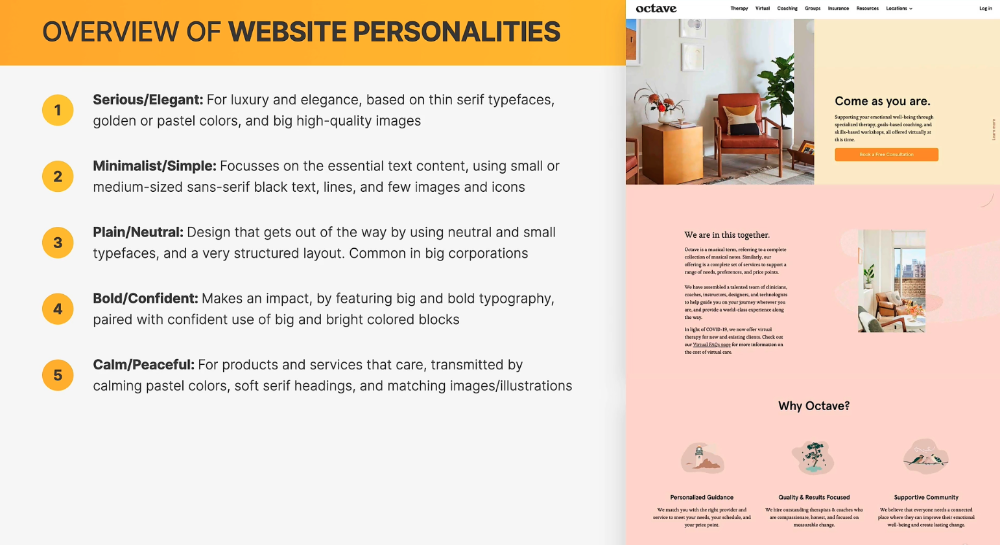

## Startup / Upbeat

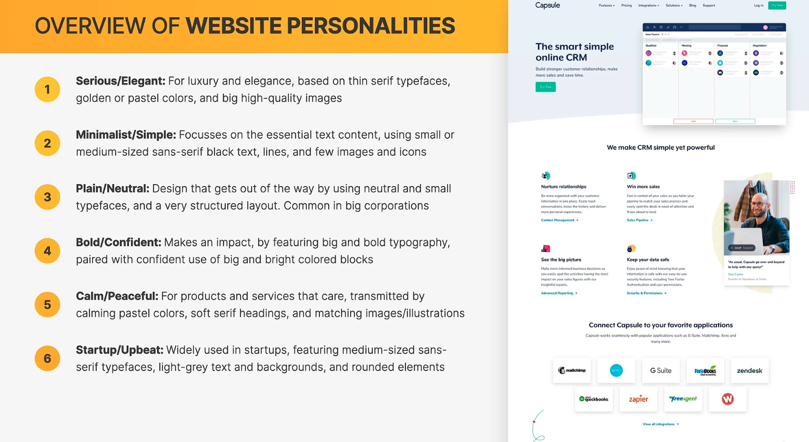

## Playful / Fun

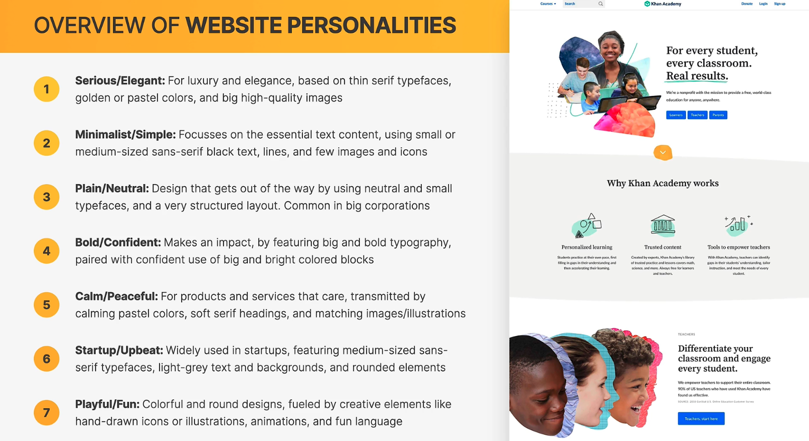

## Font style

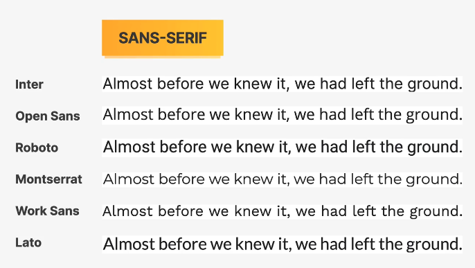
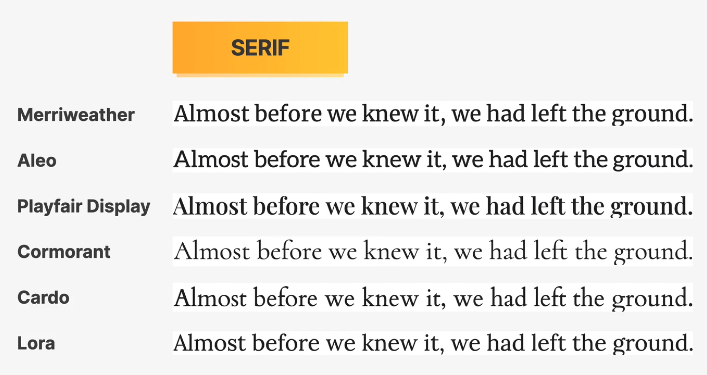

## Font size

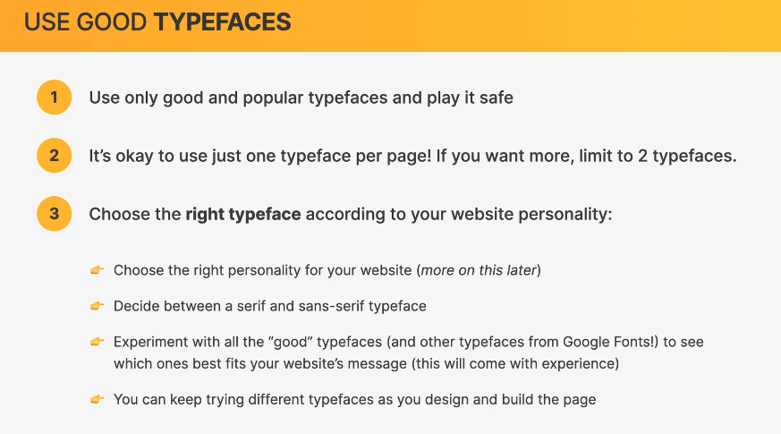
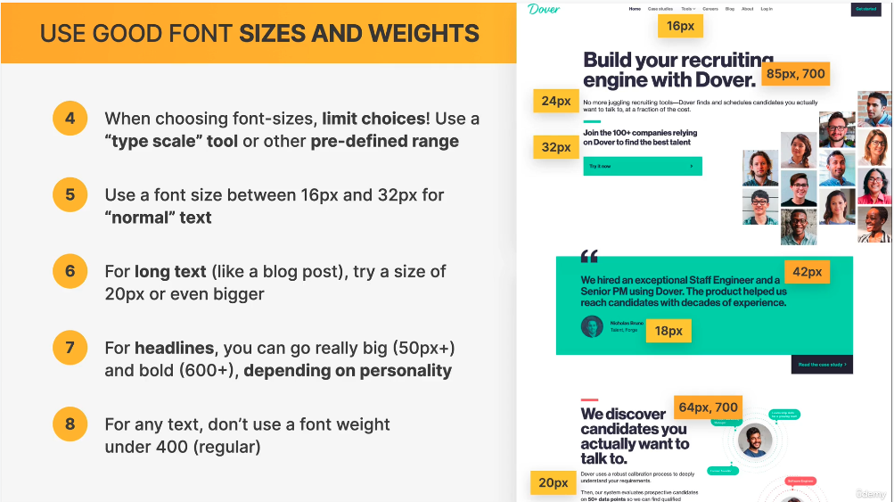

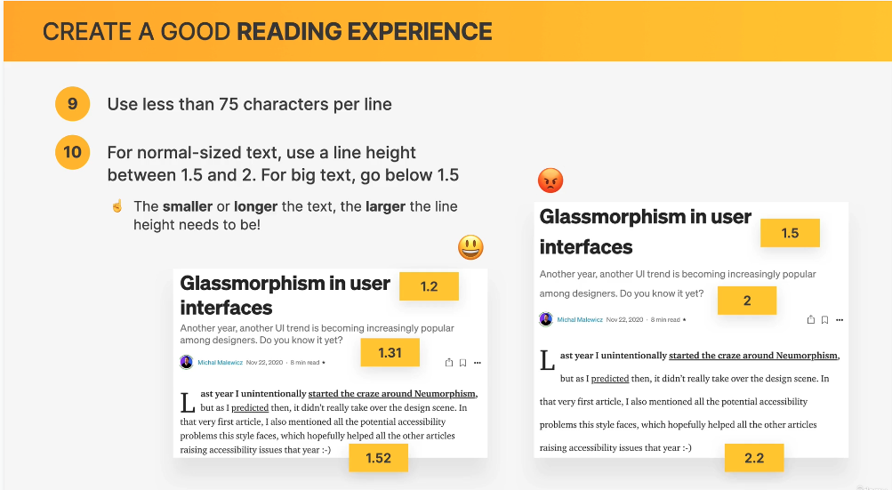

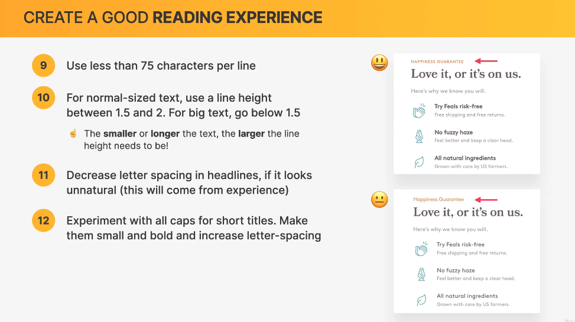
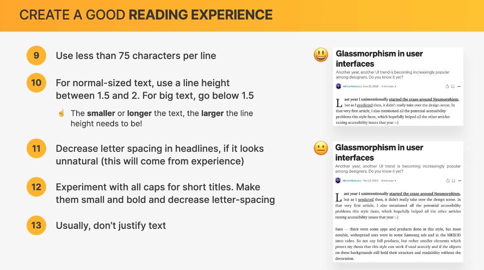


### choose font size

```text

SPACING SYSTEM (px)
2 / 4 / 8 / 12 / 16 / 24 / 32 / 48 / 64 / 80 / 96 / 128

FONT SIZE SYSTEM (px)
10 / 12 / 14 / 16 / 18 / 20 / 24 / 30 / 36 / 44 / 52 / 62 / 74 / 86 / 98
```
